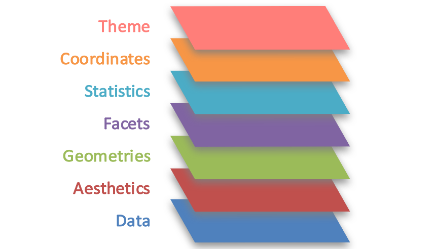
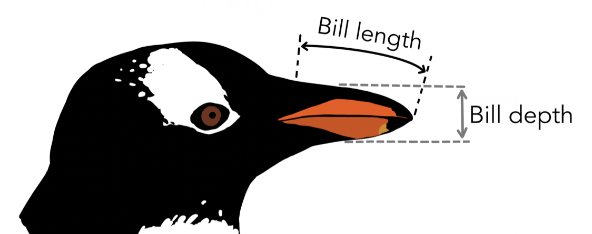

```{r cache=TRUE, setup, include=FALSE}
library(tidyverse)
library(palmerpenguins)
library(babynames)
library(gapminder)
library(gganimate)
library(plotly)
library(gifski)
options(htmltools.dir.version = FALSE)
options(htmltools.preserve.raw = FALSE)
knitr::opts_chunk$set(fig.retina = 3, fig.align = 'center', warning = FALSE, message = FALSE, dpi = 600)
```

```{r cache=TRUE, xaringan-themer, include=FALSE, warning=FALSE}
# Colores uniovi
verde <- "#018082"
amarillo_oscuro <- "#EAAE30"
amarillo_claro <- "#F4D598"
azul <- "#53A0D5"

library(xaringanthemer)
style_mono_accent(
  # Colors ---
  base_color = verde,
 # link_color = azul,
  code_inline_background_color = "#F8F8F8",
  inverse_background_color = amarillo_claro,
  base_font_size = "18px",
  # Fonts ---
  # header_font_google = google_font("Josefin Sans"),
  header_font_google = google_font("Rubik"),
  text_font_google   = google_font("Roboto Slab", "300", "300i"),
  code_font_google   = google_font("Fira Mono")
  #code_font_google   = google_font("Source Code Pro")
)
```

```{css, echo = FALSE}
.huge .remark-code { /*Change made here*/
  font-size: 150% !important;
}
.big .remark-code { /*Change made here*/
  font-size: 120% !important;
}
.small .remark-code { /*Change made here*/
  font-size: 85% !important;
}
.tiny .remark-code { /*Change made here*/
  font-size: 70% !important;
}
```

# Aim of this course:

1. Get familiar with the **grammar of graphics**.
1. Use `R` with the IDE `RStudio` for developing graphs.
1. Know the potential of the packages for data visualization:
  1. `ggplot2`
  1. `patchwork`
  1. `plotly`
  1. `gganimate`
  1. `wordcloud`
  1. `waffle`

## Prelimiaries

- R installed
- RStudio installed

---

# Grammar of graphics

- Theoretical approximation for building plots.
- Used by different software: ggplot, tableau, vega-lite.
- Not focused on:
  - the type of graphic that is better depending on the data.
  - the visual aspect of the graphic.
  - the algorithm necessary to define the graphic.
- It is focus on the process:
  - How to design the system that makes able to build the plot?

.footnote[Grammar of graphics: [https://www.springer.com/gp/book/9780387245447](https://www.springer.com/gp/book/9780387245447)]

---

# Grammar of graphics



---

# Tools: `ggplot2`

- `ggplot2` is an **implementation** of the grammar of graphics.
- theory and practice are different: some of the layers can be mapped together.

### Installation and use

```{r cache=TRUE, eval=FALSE}
install.packages("ggplot2")
library(ggplot2)
```

---

# Plots depending on the data to visualize

Different plots depending on the type of data. Some examples:

- Numerical data
  - One variable: histogram 
  - Two variables: scatterplots
- Categorical data
  - One variable: Barplot
  - Two variables: Gráfico de barras coloreado
- Both numerical and categorical data
  - Colored scatterplot
  - Boxplot divided by categories
  ...

.footnote[More details in: https://www.data-to-viz.com]

---

# Data types in `R`

- Continuous variables:
  - Integer numbers `int`
  - Decimal numbers `dbl`
  - All the numbers, `num`
- Categorical variables: 
  - Factors `fct`
  - Ordered factors `ord`

Other common types:

- Not available `NA`
- Not a number `NaN`
- Empty `NULL` 

---

#  Dataset: `penguins` 🐧 

```{r cache=TRUE, eval=FALSE}
install.packages("palmerpenguins")
palmerpenguins::penguins
```

Data about 344 penguins of 3 different species, in 3 islands of the Archipelago Palmer, Antárctica.

- `species           ` : Adelie, Chinstra, Gentoo. Type `fct` 
- `island            ` : Biscoe, Dream, Torgersen. Type `fct` 
- `bill_length_mm    ` : Length of the bill in mm. Type `dbl` 
- `bill_depth_mm     ` : Depth of the bill in mm. Type `dbl` 
- `flipper_length_mm ` : Length of the flipper in mm. Type `int` 
- `body_mass_g       ` : Body mass in f. Type `int` 
- `sex               ` : Male, Female. Type `fct` 
- `year              ` : Year (2007, 2008, 2009). Type `int` 


---

# Penguins 🐧

```{r cache=TRUE, echo=FALSE, tidy=FALSE}
rmarkdown::paged_table(penguins)
```


---

# Visualizations for a single categorical variable: barplot

- Barplot for counting the number of penguins found in each island

.pull-left[
```{r cache=TRUE, echo=FALSE, fig.height=3, dpi = 600}
ggplot(data = penguins, aes(x = island)) + stat_count()
```


```{r cache=TRUE, eval=FALSE, include=TRUE, dpi = 600}
ggplot(data = penguins, 
       aes(x = island)) + 
  stat_count()
```
]

--

.pull-right[
```{r cache=TRUE, echo=FALSE, fig.height=3, dpi = 600}
ggplot(data = penguins, 
       aes(x = island)) + 
  geom_bar()
```


```{r cache=TRUE, eval=FALSE, include=TRUE, dpi = 600}
ggplot(data = penguins, 
       aes(x = island)) + 
  geom_bar()
```
]

---

# Visualizations for a single categorical variable: histogram


```{r cache=TRUE, echo=FALSE, fig.height=3, dpi = 600, warning=FALSE}
ggplot(penguins, aes(bill_length_mm)) +
  geom_histogram()
```

--

```{r cache=TRUE, eval=FALSE, include=TRUE}
ggplot(data = penguins, aes(x = bill_length_mm)) +
  geom_histogram()
```

---
class: middle, center, inverse

# Exercise

---

#  Dataset: `diamonds` 💎 

```
ggplot2::diamonds
```

Dataset about the prices and other attributes of 53940 diamonds. 

- `carat   `: weight of the diamond (0.2–5.01) `dbl`
- `cut     `: quality of the cut (Fair, Good, Very Good, Premium, Ideal) `ord`
- `color   `: diamond color, from D (best) to J (worst)`ord`
- `clarity `: a measurement of how clear the diamond is (I1 (worst), SI2, SI1, VS2, VS1, VVS2, VVS1, IF (best)) `ord`
- `depth   `: total depth percentage = z / mean(x, y) = 2 * z / (x + y) (43–79) `dbl`
- `table   `: width of top of diamond relative to widest point (43-95) `dbl`
- `price   `: price of the diamond in US dollars (\$326–\$18,823) `int`
- `x       `: length in mm (0–10.74) `dbl`
- `y       `: width in mm (0–58.9) `dbl`
- `z       `: depth in mm (0–31.8) `dbl`

---

#  Diamonds 💎

```{r cache=TRUE, echo=FALSE, tidy=FALSE}
rmarkdown::paged_table(head(diamonds, 500))
```


---

# Exercises

.pull-left[
```{r cache=TRUE, echo=FALSE, fig.height=3, dpi = 300}
ggplot(data = diamonds, 
       aes(x = cut)) +
  stat_count()
```
]

.pull-right[
```{r cache=TRUE, echo=FALSE, fig.height=3, dpi = 300}
ggplot(data = diamonds, 
       aes(x = clarity)) + 
  stat_count()
```
]

---

# Solutions

.pull-left[
```{r cache=TRUE, echo=FALSE, fig.height=3, dpi = 300}
ggplot(data = diamonds, aes(x = cut)) +
  stat_count()
```


```
ggplot(data = diamonds, 
        aes(x = cut)) +
  stat_count() 
```


]

.pull-right[
```{r cache=TRUE, echo=FALSE, fig.height=3, dpi = 300}
ggplot(data = diamonds, aes(x = clarity)) +
  stat_count()
```


```
ggplot(data = diamonds, 
        aes(x = clarity)) +
  stat_count()
```

]


---
class: center, middle

# Visualizations for two numerical variables

## Scatterplot
 
and also modification of different aesthetics 

---

#  Data: `penguins` 🐧 



---

# Scatterplot

```{r cache=TRUE, echo=FALSE, fig.height=3, warning = FALSE, dpi = 300}
ggplot(data = penguins, aes(x = bill_length_mm, y = bill_depth_mm)) +
  geom_point()
```

--

```{r cache=TRUE, eval=FALSE, include=TRUE}
ggplot(data = penguins, aes(x = bill_length_mm, y = bill_depth_mm)) +
  geom_point()
```

--

Or also:

```{r cache=TRUE, eval=FALSE, include=TRUE}
ggplot(penguins, aes(bill_length_mm, bill_depth_mm)) + #<<
  geom_point()
```

---

## Color 🎨

```{r cache=TRUE, echo=FALSE, fig.height=3, dpi = 300, warning = FALSE}
ggplot(penguins, aes(bill_length_mm, bill_depth_mm)) +
  geom_point(color = "blue")
```

--

```{r cache=TRUE, eval=FALSE, include=TRUE}
ggplot(penguins, aes(bill_length_mm, bill_depth_mm)) +
  geom_point(color = "blue") #<<
```

--

Colors predefined that can be used with: http://sape.inf.usi.ch/quick-reference/ggplot2/color 

---

## Personal color 🧑‍🎨

```{r cache=TRUE, echo=FALSE, fig.height=3, warning=FALSE, dpi=300}
ggplot(penguins, aes(bill_length_mm, bill_depth_mm)) +
  geom_point(color = "#fabada")
```

--

```{r cache=TRUE, eval=FALSE, include=TRUE}
ggplot(penguins, aes(bill_length_mm, bill_depth_mm)) +
  geom_point(color = "#fabada") #<<
```

--

To found more colors: [https://coolors.com](https://coolors.com)

---

## Adding more `geom`s

```{r cache=TRUE, echo=FALSE, fig.height=3, warning=FALSE, dpi=300}
ggplot(penguins, aes(bill_length_mm, bill_depth_mm)) +
  geom_point(color = "#fabada") +
  geom_hline(yintercept = 15.2) 
```

--

```{r cache=TRUE, eval=FALSE, include=TRUE}
ggplot(penguins, aes(bill_length_mm, bill_depth_mm)) +
  geom_point(color = "#fabada") +
  geom_hline(yintercept = 15.2) #<<
```

---

## Adding more `geom`s

```{r cache=TRUE, echo=FALSE, fig.height=3, warning=FALSE, dpi=300}
ggplot(penguins, aes(bill_length_mm, bill_depth_mm)) +
  geom_point(color = "#fabada") +
  geom_hline(yintercept = 15.2) +
  geom_vline(xintercept = 43) 
```

--

```{r cache=TRUE, eval=FALSE, include=TRUE}
ggplot(penguins, aes(bill_length_mm, bill_depth_mm)) +
  geom_point(color = "#fabada") +
  geom_hline(yintercept = 15.2) +
  geom_vline(xintercept = 43) #<<
```

---

## Adding more `geom`s

```{r cache=TRUE, echo=FALSE, fig.height=3, warning=FALSE, dpi=300}
ggplot(penguins, aes(bill_length_mm, bill_depth_mm)) +
  geom_point(color = "#fabada") +
  geom_hline(yintercept = 15.2, color = "red", linetype = "dotted") +  
  geom_vline(xintercept = 43, color = "grey", linetype = "dashed")  
```

--

```{r cache=TRUE, eval=FALSE, include=TRUE}
ggplot(penguins, aes(bill_length_mm, bill_depth_mm)) +
  geom_point(color = "#fabada") +
  geom_hline(yintercept = 15.2, color = "red", linetype = "dotted") +  #<<
  geom_vline(xintercept = 43, color = "grey", linetype = "dashed")  #<<
```

All the types of lines can be found here [here](http://www.sthda.com/english/wiki/ggplot2-line-types-how-to-change-line-types-of-a-graph-in-r-software).

---

## Generic lines

```{r cache=TRUE, echo=FALSE, fig.height=3, warning=FALSE, dpi=300}
ggplot(penguins, aes(bill_length_mm, bill_depth_mm)) +
  geom_point(color = "#fabada") +
  geom_abline(slope = .3, intercept = 2)
```

--

```{r cache=TRUE, eval=FALSE, include=TRUE}
ggplot(penguins, aes(bill_length_mm, bill_depth_mm)) +
  geom_point(color = "#fabada") +
  geom_abline(slope = .3, intercept = 2) #<<
```

---

## Change the size ☝🏻

```{r cache=TRUE, echo=FALSE, fig.height=3, warning=FALSE, dpi=300}
ggplot(penguins, aes(bill_length_mm, bill_depth_mm)) +
  geom_point(color = "#fabada") +
  geom_abline(slope = .3, intercept = 2, size = 2) 
```

--

```{r cache=TRUE, eval=FALSE, include=TRUE}
ggplot(penguins, aes(bill_length_mm, bill_depth_mm)) +
  geom_point(color = "#fabada") +
  geom_abline(slope = .3, intercept = 2, size = 2) #<<
```

---

## The order matters

```{r cache=TRUE, echo=FALSE, fig.height=3, warning=FALSE, dpi=300}
ggplot(penguins, aes(bill_length_mm, bill_depth_mm)) +
  geom_abline(slope = .3, intercept = 2, size = 2) + #<<
  geom_point(color = "#fabada") #<<
```

--

```{r cache=TRUE, eval=FALSE, include=TRUE}
ggplot(penguins, aes(bill_length_mm, bill_depth_mm)) +
  geom_abline(slope = .3, intercept = 2, size = 2) + #<<
  geom_point(color = "#fabada") #<<
```

---

## Mapping a variable as `color`

```{r cache=TRUE, echo=FALSE, fig.height=3, warning=FALSE, dpi=300}
ggplot(penguins, aes(bill_length_mm, bill_depth_mm, color = sex)) + #<<
  geom_point()
```

--

```{r cache=TRUE, eval=FALSE, include=TRUE}
ggplot(penguins, aes(bill_length_mm, bill_depth_mm, color = sex)) + #<<
  geom_point()
```

---

## Aesthetic vs. appearane ⚠️


```{r cache=TRUE, fig.height=1, warning=FALSE, dpi=300}
ggplot(penguins, aes(bill_length_mm, bill_depth_mm)) +
  geom_point(color = "blue") #<<
```


```{r cache=TRUE, fig.height=1, warning=FALSE, dpi=300}
ggplot(penguins, aes(bill_length_mm, bill_depth_mm, color = sex)) + #<<
  geom_point()
```

---

## Personalizing the palette of colors 🖼️

```{r cache=TRUE, fig.height=4, warning=FALSE, dpi=300}
ggplot(penguins, aes(bill_length_mm, bill_depth_mm, color = sex)) +
  geom_point() +
  scale_color_manual(values = c("green", "orange")) #<<
```

[Here](http://www.sthda.com/english/wiki/ggplot2-colors-how-to-change-colors-automatically-and-manually) you can found more examples and paletter in R.

---

# Default palettes 🎨

```{r cache=TRUE,, echo=FALSE, fig.height=2}
knitr::include_graphics("./imgs/paletas.png")
```

---

# Default palettes 🎨

```{r cache=TRUE, echo=FALSE, fig.height=3, warning=FALSE, dpi = 200}
ggplot(penguins, aes(bill_length_mm, bill_depth_mm, color = sex)) +
  geom_point() + 
  scale_color_brewer(palette="Dark2")
```

--

```{r cache=TRUE, eval=FALSE, include=TRUE}
ggplot(penguins, aes(bill_length_mm, bill_depth_mm, color = sex)) +
  geom_point() + 
  scale_color_brewer(palette="Dark2") #<<
```

---

# Some more packages 🧑‍🎨

```{r cache=TRUE,}
# install.packages("wesanderson")
library(wesanderson)
```

```{r cache=TRUE,}
names(wes_palettes)
```

---

# Some more packages 🧑‍🎨

```{r cache=TRUE, echo=FALSE, fig.height=3, warning=FALSE, dpi = 200}
ggplot(penguins, aes(bill_length_mm, bill_depth_mm, color = sex)) +
  geom_point() + 
  scale_color_manual(values=wes_palette(n=3, name="GrandBudapest1")) 
```

--

```{r cache=TRUE, eval=FALSE, include=TRUE}
ggplot(penguins, aes(bill_length_mm, bill_depth_mm, color = sex)) +
  geom_point() + 
  scale_color_manual(values=wes_palette(n=3, name="GrandBudapest1")) #<<
```

---

## Using conditions to color

```{r cache=TRUE, echo=FALSE, fig.height=5, warning=FALSE, dpi = 200}
ggplot(penguins, aes(bill_length_mm, bill_depth_mm, 
                     color = body_mass_g > 4000)) + 
  geom_point()
```

--

```{r cache=TRUE, eval=FALSE, include=TRUE}
ggplot(penguins, aes(bill_length_mm, bill_depth_mm, 
                     color = body_mass_g > 4000)) + #<<
  geom_point()
```

---

## More aesthetics: `shape`

```{r cache=TRUE, echo=FALSE, fig.height=3, warning=FALSE, dpi = 200}
ggpubr::show_point_shapes()
```

By default, `ggplot` uses `shape = 16`.

- Some of the shapes have only `color`, which colors (fills) the interior of the shape.
- Some other shapes have `color` for the border and then `fill` for coloring the inside of the shape.

---

## More aesthetics: `shape`

```{r cache=TRUE, echo=FALSE, fig.height=3, warning=FALSE, dpi = 200}
ggplot(penguins, aes(bill_length_mm, bill_depth_mm)) +
  geom_point(shape = 17) 
```

--

```{r cache=TRUE, eval=FALSE, include=TRUE}
ggplot(penguins, aes(bill_length_mm, bill_depth_mm)) +
  geom_point(shape = 17) #<<
```

---

## Again, aesthetic vs. appearance ⚠️

```{r cache=TRUE, echo=FALSE, fig.height=3, warning=FALSE, dpi = 200}
ggplot(penguins, aes(bill_length_mm, bill_depth_mm, 
                     shape = island)) + #<<
  geom_point()
```

--

```{r cache=TRUE, eval=FALSE, include=TRUE}
ggplot(penguins, aes(bill_length_mm, bill_depth_mm, 
                     shape = island)) + #<<
  geom_point()
```

---

## Shapes can be combined

```{r cache=TRUE, echo=FALSE, fig.height=3, warning=FALSE, dpi = 200}
ggplot(penguins, aes(bill_length_mm, bill_depth_mm, 
                     shape = island, color = sex)) + #<<
  geom_point()
```

--

```{r cache=TRUE, eval=FALSE, include=TRUE}
ggplot(penguins, aes(bill_length_mm, bill_depth_mm, 
                     shape = island, color = sex)) + #<<
  geom_point()
```

---

## Difference between `color` and `fill`

Vamos a elegir una de las formas con contorno:

```{r cache=TRUE, fig.height=4, warning=FALSE, dpi = 200}
ggplot(penguins, aes(bill_length_mm, bill_depth_mm)) +
  geom_point(shape = 23)
```

---

## Difference between `color` and `fill`

.pull-left[
```{r cache=TRUE, echo=FALSE, fig.height=3, warning=FALSE, dpi = 200}
ggplot(penguins, aes(bill_length_mm, bill_depth_mm, 
                     color = sex)) + #<<
  geom_point(shape = 23)
```

--

```{r cache=TRUE, eval=FALSE, include=TRUE}
ggplot(penguins, 
       aes(bill_length_mm, 
           bill_depth_mm, 
           color = sex)) + #<<
  geom_point(shape = 23)
```


]

.pull-right[
```{r cache=TRUE, echo=FALSE, fig.height=3, warning=FALSE, dpi = 200}
ggplot(penguins, aes(bill_length_mm, bill_depth_mm, 
                     fill = sex)) + #<<
  geom_point(shape = 23)
```

--

```{r cache=TRUE, eval=FALSE, include=TRUE}
ggplot(penguins, 
       aes(bill_length_mm, 
           bill_depth_mm, 
           fill = sex)) + #<<
  geom_point(shape = 23)
```
]

---

## Difference between `color` and `fill`

```{r cache=TRUE, fig.height=4, warning=FALSE, dpi = 200}
ggplot(penguins, aes(bill_length_mm, bill_depth_mm, 
                     color = island, fill = sex)) + #<<
  geom_point(shape = 23)
```

It is possible, but the result is not so good... 🥴

---

## Another aesthetic: `size`

```{r cache=TRUE, echo=FALSE, fig.height=3, warning=FALSE, dpi = 200}
ggplot(penguins, aes(bill_length_mm, bill_depth_mm, size = island)) +
  geom_point(color = "blue")
```

--

```{r cache=TRUE, eval=FALSE, include=TRUE}
ggplot(penguins, aes(bill_length_mm, bill_depth_mm, 
                     size = island)) + #<<
  geom_point(color = "blue")
```

---

# The value of `alpha`

Usually when the `size` is increased the data points overlap

```{r cache=TRUE, echo=FALSE, fig.height=3, warning=FALSE, dpi = 200}
ggplot(penguins, aes(bill_length_mm, bill_depth_mm, size = island)) +
  geom_point(color = "blue", alpha = .4)
```

--

```{r cache=TRUE, eval=FALSE, include=TRUE}
ggplot(penguins, aes(bill_length_mm, bill_depth_mm, size = island)) +
  geom_point(color = "blue", alpha = .4) #<<
```

---

# The aesthetic `alpha`

```{r cache=TRUE, echo=FALSE, fig.height=3, warning=FALSE, dpi = 200}
ggplot(penguins, aes(bill_length_mm, bill_depth_mm, 
                     size = island,
                     alpha = island)) + #<<
  geom_point(color = "blue")
```

--

```{r cache=TRUE, echo=TRUE, include=FALSE}
ggplot(penguins, aes(bill_length_mm, bill_depth_mm, 
                     size = island,
                     alpha = island)) + #<<
  geom_point(color = "blue")
```

Look how the legends are unified when the same variable is mapped using two different aesthetics.

---

# To sum up

.pull-left[
## `geom_`

- `geom_bar()`
- `geom_point()`
- `geom_hline()`
- `geom_vline()`
- `geom_abline()`
]

.pull-right[
## aesthetics

These can be mapped as `aes()` if they take their value from a variable of the dataset and also as a general modification of a `geom` for changing the appearance 

- `color`
- `fill`
- `alpha`
- `size`
]

---

# Storing the plot

```{r cache=TRUE, fig.height=4}
p <- ggplot(penguins, aes(bill_length_mm, bill_depth_mm)) +
  geom_point(color = "blue")
p
```

Now the *object* `p` is available and can be reused.

---

# Modifying an object

More layers can be overlapped over a previously stored plot

```{r cache=TRUE, fig.height=3}
p + labs(title="Relationship bill_depth/bill_length in mm")
```

---

# Themes

The `ggplot` package has already more themes predefined which allow a quick modification of the final appearance of the plot.

- `theme_grey`
- `theme_bw`
- `theme_linedraw`
- `theme_light`
- `theme_dark`
- `theme_minimal`
- `theme_classic`
- `theme_void`

---

.pull-left[

```{r cache=TRUE, fig.height=4, warning=FALSE, dpi = 200}
p + theme_grey()
```

```{r cache=TRUE, fig.height=4, warning=FALSE, dpi = 200}
p + theme_linedraw()
```


]

.pull-right[

```{r cache=TRUE, fig.height=4, warning=FALSE, dpi = 200}
p + theme_bw()
```

```{r cache=TRUE, fig.height=4, warning=FALSE, dpi = 200}
p + theme_light()
```

]

---


.pull-left[

```{r cache=TRUE, fig.height=4, warning=FALSE, dpi = 200}
p + theme_dark()
```

```{r cache=TRUE, fig.height=4, warning=FALSE, dpi = 200}
p + theme_classic()
```


]

.pull-right[

```{r cache=TRUE, fig.height=4, warning=FALSE, dpi = 200}
p + theme_minimal()
```

```{r cache=TRUE, fig.height=4, warning=FALSE, dpi = 200}
p + theme_void()
```

]

More information about themes can be found [here](https://ggplot2.tidyverse.org/reference/ggtheme.html).

---

# Some other packages with predefined themes

```{r cache=TRUE, eval=FALSE}
library(hrbrthemes)
```

---

# Continuous values in `size`


```{r cache=TRUE, fig.height=4, warning=FALSE, dpi = 200}
ggplot(penguins, aes(bill_length_mm, 
                     bill_depth_mm, 
                     size = year)) +
  geom_point(color = "blue")
```

---

# Forze a variable to be categorical

Now we want to change the size of the points depending on the year when the datum was gathered.

Going back to the penguins dataset, the `year` variable is a numerical variable.

However, there are only three different years. To forze this to be treated as a categorical variable it is possible to use `as.factor()`

---

# Forze a variable to be categorical

```{r cache=TRUE, echo=FALSE, fig.height=5, warning=FALSE, dpi = 200}
ggplot(penguins, aes(bill_length_mm, bill_depth_mm, size = as.factor(year))) +
  geom_point(color = "blue")
```

--

```{r cache=TRUE, eval=FALSE, include=TRUE}
ggplot(penguins, aes(bill_length_mm, bill_depth_mm, size = as.factor(year))) +
  geom_point(color = "blue")
```

---

## Modify the title of the legend

However the title of the legend shows the raw code used, how to change the title?

--

.pull-left[
```{r cache=TRUE, echo=FALSE, fig.height=5, warning=FALSE, dpi = 200}
ggplot(penguins, aes(bill_length_mm, bill_depth_mm, size = as.factor(year))) +
  geom_point(color = "blue")
```
]

.pull-right[
```{r cache=TRUE, echo=FALSE, fig.height=5}
ggplot(penguins, aes(bill_length_mm, bill_depth_mm, size = as.factor(year))) +
  geom_point(color = "blue") +
  labs(size = "Año")
```
]

---

## Categorical variable in the `y` axis

So far we have used continuous variables in both axis. What happens if a categorical variables is used with `geom_point()`? For example, now `body_mass_g` is plotted in the `y` axis:

```{r cache=TRUE, eval=FALSE, include=TRUE}
ggplot(penguins, aes(species, body_mass_g)) + #<<
  geom_point()
```

```{r cache=TRUE, echo=FALSE, fig.height=3}
ggplot(penguins, aes(species, body_mass_g)) +
  geom_point()
```

---

## Color using a continuous variable

So far the color has been changed using categorical variables. Below there is an example of using the numerical variable `body_mass_g`

```{r cache=TRUE, fig.height=4, warning=FALSE, dpi = 200}
ggplot(penguins, aes(species, body_mass_g, color = body_mass_g)) +
  geom_point()
```

---

## What happens with the `shape`?

Para shape también hemos utilizado solo variables discretas, ¿qué pasa si intentamos poner una continua?

---

# Color with a categorical variable

We know already how to do this

```{r cache=TRUE, fig.height=4, warning=FALSE, dpi = 200}
ggplot(penguins, aes(species, body_mass_g, color = species)) +
  geom_point()
```

--

In this plot, the points are overlapping too much, some jitter can be added in the $x$ to add some randomness in the representation and avoid the points to overlap.

---

# Adding jitter

```{r cache=TRUE, fig.height=4, warning=FALSE, dpi = 200}
ggplot(penguins, aes(species, body_mass_g, color = species)) +
  geom_jitter(height = 0)
```

---

# Statistics

```{r cache=TRUE, fig.height=4, warning=FALSE, dpi = 200}
ggplot(penguins, aes(species, body_mass_g, color = species)) +
  geom_jitter() +
  stat_summary(fun = mean)
```

---

# Aesthetics that are exclusive for each geom

```{r cache=TRUE, fig.height=4, warning=FALSE, dpi = 200}
ggplot(penguins, aes(species, body_mass_g)) +
  geom_point(aes(color = species)) +
  stat_summary(fun = mean)
```

---

# Aesthetics that are exclusive for each geom

```{r cache=TRUE, fig.height=4, warning=FALSE, dpi = 200}
ggplot(penguins, aes(species, body_mass_g)) +
  stat_summary(fun = mean, size = 2) +
  geom_point(aes(color = species)) 
```

---

# Comparison 

Both give the same output

```
ggplot(penguins, aes(species, body_mass_g, color = species)) +
  geom_point() 
```

```
ggplot(penguins, aes(species, body_mass_g)) +
  geom_point(aes(color = species)) 
```

This gives a different output

```
ggplot(penguins, aes(species, body_mass_g)) +
  geom_point(color = "blue") 
```

---

# Change the labels

Another option:

```{r cache=TRUE, fig.height=4, warning=FALSE, dpi = 200}
ggplot(penguins, aes(island, species, color = species)) +
  geom_jitter() +
  xlab("The specie") +
  ylab("The island") 
```


---

## Two categorical variables

What happens if we want to do a diagram with two categorical variables? 

--

```{r cache=TRUE, fig.height=4, warning=FALSE, dpi = 200}
ggplot(penguins, aes(island, species, color = species)) +
  geom_point()
```

`geom_point` is not the best option

---

## Using jitter

```{r cache=TRUE, fig.height=4, warning=FALSE, dpi = 200}
ggplot(penguins, aes(island, species, color = species)) +
  geom_jitter()
```

In this case the randomness can be added in both axis

---

# Modifying the labels

```{r cache=TRUE, fig.height=4, warning=FALSE, dpi = 200}
ggplot(penguins, aes(island, species, color = species)) +
  geom_jitter() +
  xlab("The specie") +
  ylab("The island") 
```

---
class: center, inverse, middle

# Barplot

---

# With a single variable

We already know how to do this:

```{r cache=TRUE, fig.height=4}
ggplot(penguins, aes(species)) +
  geom_bar()
```

---

# Barplot

Color using the sex of the penguins

```{r cache=TRUE, echo=FALSE, fig.height=3}
ggplot(penguins, aes(species, fill = sex)) +
  geom_bar()
```

--

```{r cache=TRUE, include=TRUE, eval=FALSE}
ggplot(penguins, aes(species, fill = sex)) +
  geom_bar()
```


---

# Barplot: A common error


A common error when using `stat_count()` is:


```
stat_count() can only have an x or y aesthetic.
```

- It happens when more than one variables are given in `aes()`.
- A common situation is that, when trying to define a color, the `color =` or `fill = ` is not added so the functions believes that we are trying to change the value of `y`.

---

# Positions: `stack`

The default position is `stack`:

```{r cache=TRUE, fig.height=4}
ggplot(penguins, aes(species, fill = sex)) +
  geom_bar(position = "stack")
```

---

# Positions: `dodge`

```{r cache=TRUE, fig.height=4}
ggplot(penguins, aes(species, fill = sex)) +
  geom_bar(position = "dodge")
```

---

# Positions: `dodge`

Usefull for questions such as: In which island are there more penguins of the Adelie species?
  - The plot on the right makes possible a better comparison

.pull-left[
```{r cache=TRUE, fig.height=4}
ggplot(penguins, 
       aes(island, 
           fill = species)) + 
  geom_bar() #<<
```

]

.pull-right[

```{r cache=TRUE, fig.height=4}
ggplot(penguins, 
       aes(island, 
           fill = species)) + 
  geom_bar(position = "dodge") #<<
```

]

---

# Labels in position `stack`

Labels can be added to the `geom_bar()` for a more usefull comparison

```{r cache=TRUE, fig.height=4}
ggplot(penguins, aes(species, fill = sex)) + 
  geom_bar() +
  geom_text(stat='count', aes(label=..count..), #<<
            position = position_stack(vjust=.5)) #<<
```

---

# Labels in position `stack`

```{r cache=TRUE, eval=FALSE}
ggplot(penguins, aes(species, fill = sex)) + 
  geom_bar() +
  geom_text(stat='count', aes(label=..count..), 
            position = position_stack(vjust=.5)) #<<
```

The parameter `vjust` represents the vertical adjustment:

- 0 for alignment with the bottom
- 0.5 for alignment with the middle
- 1 (default) for alignment with the top

---

# Labels in position `dodge`

```{r cache=TRUE, fig.height=4}
ggplot(penguins, aes(species, fill = sex)) + 
  geom_bar(position = "dodge") +
  geom_text(stat='count', #<<
            aes(label=..count..), #<<
            vjust = -1, #<<
            position = position_dodge(width = 1)) #<<
```

---

# Summarized data

Let us create a new dataset, `penguins_total`, which summarizes the information given in the original dataset.

```{r cache=TRUE, fig.height=4}
penguins_total <- penguins %>% # Initial dataset
  group_by(species, sex) %>% # Groups are created
  count() # Count the number of objects in each group
penguins_total # Final result
```


---

# Summarized data: stat `identity`

Now it is not possible to use the stat `count`

```{r cache=TRUE, fig.height=4}
ggplot(penguins_total, 
       aes(x = species, y = n, fill = sex)) + #<<
  geom_bar(stat = "identity") #<<
```

---

# Summarized data: position `dodge`

```{r cache=TRUE, fig.height=4}
ggplot(penguins_total, 
       aes(x = species, y = n, fill = sex)) +
  geom_bar(stat = "identity", 
           position = "dodge") #<<
```

---
class: center, middle, inverse

# Esquisser

---

# Esquisser

- Tool for developing graphs using the `ggplot2`.
- Interface *drag-and-drop* that makes possible to map variables in different aesthetics. 
- Dynamical generation of the code
- Dynamical visualization of the plot

```{r cache=TRUE, eval=FALSE}
install.packages("esquisse")
esquisse::esquisser()
```

.footnote[
Reference to the package in the CRAN repository: https://cran.r-project.org/web/packages/esquisse/index.html

Blog with more details: https://www.business-science.io/code-tools/2021/03/23/ggplot-code-with-tableau-esquisse.html?utm_content=bufferf9d3e&utm_medium=social&utm_source=linkedin.com&utm_campaign=buffer
]

---

# Esquisser

**Advantadges:**

- Friendly interface that makes possible to avoid writing the code *from scratch*

**Disadvantadges:**

- Limited options
- Very young software 🪲🐛

---

# The code is important

.pull-left[

**Exercise 1**

```{r cache=TRUE, echo=FALSE, fig.height=5}
ggplot(penguins, aes(island, fill = species)) +
  geom_bar(position = "fill", alpha = .3, color = "black") +
  geom_text(aes(label = ..count..), 
            stat="count", 
            position = position_fill(vjust=.5), 
            fontface = "bold") +
  scale_y_continuous(labels = scales::percent) +
  xlab("The island") +
  ylab("") +
  guides(fill=guide_legend(title="The specie")) +
  theme_light() +
  theme(panel.grid.minor.x = element_blank(),
        panel.grid.major.y = element_blank()) +
  coord_flip()
```
]

.pull-right[

**Exercise 2**

```{r cache=TRUE, echo=FALSE, fig.height=5, warning = FALSE, dpi = 200}
ggplot(penguins, aes(bill_length_mm)) +
  geom_histogram(data = penguins %>% filter(sex == "female"), aes(y = ..count.., fill = sex), alpha = .6, color = "black") +
  geom_histogram(data = penguins %>% filter(sex == "male"), aes(y = -..count.., fill = sex), alpha = .6, color = "black") +
  geom_vline(xintercept = penguins %>% pull(bill_length_mm) %>% mean(na.rm = TRUE)) +
  geom_vline(xintercept = penguins %>% filter(sex == "female") %>% pull(bill_length_mm) %>% mean(na.rm = TRUE), color = "green", linetype = "dashed", size = 1.5) +
  geom_vline(xintercept = penguins %>% filter(sex == "male") %>% pull(bill_length_mm) %>% mean(na.rm = TRUE), color = "purple", linetype = "dashed", size = 1.5) +
  geom_label(aes(x=58, y=10, label="female"), color = "green", family = "Times", fontface = "bold" ) +
  geom_label(aes(x=58, y=-10, label="male"), color = "purple", family = "Times", fontface = "bold") + 
  scale_fill_manual(values = c("green", "purple")) +
  labs(title="Histograma de pingüinos \ndividido por sexo",
       x ="Longitud del pico", y = "Número de pingüinos") +
  scale_x_continuous(n.breaks = 6) +
  scale_y_continuous(labels=abs) +
  theme_minimal() +
  theme(legend.position = "none", 
        text=element_text(size=16,  family="Times"),
        axis.title.x = element_text(margin=margin(15,0,0,0)),
        axis.title.y = element_text(margin=margin(0,15,0,0)))
```
]

<!--
- Start with a barplot (in vertical, as default)
- Adjust the colors
- Adjust the labels
- Change the theme
- Change the coords
-->

---

# Exercise 1

```{r cache=TRUE, echo=FALSE, fig.height=3}
ggplot(penguins %>% filter(!is.na(sex)), aes(island, fill = species)) +
  geom_bar(position = "fill", alpha = .3, color = "black") +
  geom_text(aes(label = ..count..), stat="count", position = position_fill(vjust=.5), fontface = "bold") +
  scale_y_continuous(labels = scales::percent) +
  xlab("The island") +
  ylab("") +
  coord_flip() +
  theme_light() +
  guides(fill=guide_legend(title="The specie")) +
  theme(panel.grid.minor.x = element_blank(),
        panel.grid.major.y = element_blank())
```

---

# Exercise 1


```{r cache=TRUE, ref.label="ejBar1", echo=FALSE, fig.height=3}
```

--

```{r cache=TRUE, ejBar1, eval=FALSE}
ggplot(penguins, aes(island)) +
  geom_bar() 
```


---

# Exercise 1


```{r cache=TRUE, ref.label="ejBar2", echo=FALSE, fig.height=3}
```

--

```{r cache=TRUE, ejBar2, eval=FALSE}
ggplot(penguins, aes(island, fill = species)) + #<<
  geom_bar() 
```

---

# Exercise 1


```{r cache=TRUE, ref.label="ejBar3", echo=FALSE, fig.height=3}
```

--

```{r cache=TRUE, ejBar3, eval=FALSE}
ggplot(penguins, aes(island, fill = species)) +
  geom_bar(position = "fill") #<<
```

---

# Exercise 1


```{r cache=TRUE, ref.label="ejBar4", echo=FALSE, fig.height=3}
```

--

```{r cache=TRUE, ejBar4, eval=FALSE}
ggplot(penguins, aes(island, fill = species)) +
  geom_bar(position = "fill", 
           alpha = .3, color = "black") #<<
```


---

# Exercise 1


```{r cache=TRUE, ref.label="ejBar5", echo=FALSE, fig.height=3}
```

--

```{r cache=TRUE, ejBar5, eval=FALSE}
ggplot(penguins, aes(island, fill = species)) +
  geom_bar(position = "fill", 
           alpha = .3, color = "black") +
  xlab("The island") + #<<
  ylab("") #<<
```


---

# Exercise 1

```{r cache=TRUE, ref.label="ejBar6", echo=FALSE, fig.height=3}
```

--

```{r cache=TRUE, ejBar6, eval=FALSE}
ggplot(penguins, aes(island, fill = species)) +
  geom_bar(position = "fill", alpha = .3, color = "black") +
  xlab("The island") + 
  ylab("") + 
  guides(fill=guide_legend(title="The specie")) #<<
```

---

# Exercise 1


```{r cache=TRUE, ref.label="ejBar7", echo=FALSE, fig.height=3}
```

--

```{r cache=TRUE, ejBar7, eval=FALSE}
ggplot(penguins, aes(island, fill = species)) +
  geom_bar(position = "fill", alpha = .3, color = "black") +
  xlab("The island") +
  ylab("") +
  guides(fill=guide_legend(title="The specie")) +
  theme_light() #<<
```


---

# Exercise 1

```{r cache=TRUE, ref.label="ejBar8", echo=FALSE, fig.height=3}
```

--

```{r cache=TRUE, ejBar8, eval=FALSE}
ggplot(penguins, aes(island, fill = species)) +
  geom_bar(position = "fill", alpha = .3, color = "black") +
  scale_y_continuous(labels = scales::percent) + #<<
  xlab("The island") +
  ylab("") +
  guides(fill=guide_legend(title="The specie")) +
  theme_light() 
```

---

# Exercise 1

```{r cache=TRUE, ref.label="ejBar9", echo=FALSE, fig.height=3}
```

--

```{r cache=TRUE, ejBar9, eval=FALSE}
ggplot(penguins, aes(island, fill = species)) +
  geom_bar(position = "fill", alpha = .3, color = "black") +
  geom_text(aes(label = ..count..), #<<
            stat="count", #<<
            position = position_fill(vjust=.5), #<<
            fontface = "bold") + #<<
  scale_y_continuous(labels = scales::percent) +
  xlab("The island") +
  ylab("") +
  guides(fill=guide_legend(title="The specie")) +
  theme_light() 
```


---

# Exercise 1

```{r cache=TRUE, ref.label="ejBar10", echo=FALSE, fig.height=3}
```

--

```{r cache=TRUE, ejBar10, eval=FALSE}
ggplot(penguins, aes(island, fill = species)) +
  geom_bar(position = "fill", alpha = .3, color = "black") +
  geom_text(aes(label = ..count..), stat="count", 
            position = position_fill(vjust=.5), 
            fontface = "bold") +
  scale_y_continuous(labels = scales::percent) +
  xlab("The island") + ylab("") +
  guides(fill=guide_legend(title="The specie")) + #<<
  theme_light() +
  theme(panel.grid.minor.x = element_blank())
```

---

# Exercise 1

```{r cache=TRUE, ref.label="ejBar11", echo=FALSE, fig.height=3}
```

--

```{r cache=TRUE, ejBar11, eval=FALSE}
ggplot(penguins, aes(island, fill = species)) +
  geom_bar(position = "fill", alpha = .3, color = "black") +
  geom_text(aes(label = ..count..), 
            stat="count", 
            position = position_fill(vjust=.5), 
            fontface = "bold") +
  scale_y_continuous(labels = scales::percent) + #<<
  xlab("The island") +
  ylab("") +
  guides(fill=guide_legend(title="The specie")) +
  theme_light() +
  theme(panel.grid.minor.x = element_blank(),
        panel.grid.major.y = element_blank())
```

---

# Exercise 1

```{r cache=TRUE, ref.label="ejBar12", echo=FALSE, fig.height=3}
```

--

```{r cache=TRUE, ejBar12, eval=FALSE}
ggplot(penguins, aes(island, fill = species)) +
  geom_bar(position = "fill", alpha = .3, color = "black") +
  geom_text(aes(label = ..count..), 
            stat="count", 
            position = position_fill(vjust=.5), 
            fontface = "bold") +
  scale_y_continuous(labels = scales::percent) +
  xlab("The island") +
  ylab("") +
  guides(fill=guide_legend(title="The specie")) +
  theme_light() +
  theme(panel.grid.minor.x = element_blank(),
        panel.grid.major.y = element_blank()) +
  coord_flip()
```


```{r cache=TRUE,}
ggplot(penguins, aes(island, fill = species)) +
  geom_bar(position = "fill", 
           alpha = 0.3, 
           color = "black") +
  geom_text(aes(label = ..count..), 
            stat = "count",
            position = position_fill(vjust = 0.5),
            fontface = "bold") +
  scale_y_continuous(labels = scales::percent) +
  xlab("The island") + 
  ylab("") +
  guides(fill = guide_legend(title = "Especie")) + #<<
  theme_light() +
  theme(panel.grid.major.x = element_blank(),
        panel.grid.minor.y = element_blank()) +
  coord_flip()
```


---

# Exercise 2

Histograma básico de la variable `bill_length_mm`

```{r cache=TRUE, ref.label="ejHisto1", echo=FALSE, fig.height=3, warning=FALSE}
```

--

.tiny[
```{r cache=TRUE, ejHisto1, eval=FALSE, warning=FALSE, dpi = 300}
ggplot(penguins, aes(bill_length_mm)) +
  geom_histogram()
```
]

---

# Exercise 2

What happens is `color` is given


```{r cache=TRUE, ref.label="ejHisto2", echo=FALSE, fig.height=3, warning=FALSE}
```


--

.tiny[
```{r cache=TRUE, ejHisto2, eval=FALSE, warning=FALSE}
ggplot(penguins, aes(bill_length_mm)) +
  geom_histogram(color = "orange") #<<
```
]

---

# Exercise 2

To really color the plot it is necessary using `fill`

```{r cache=TRUE, ref.label="ejHisto3", echo=FALSE, fig.height=3, warning=FALSE}
```

--

.tiny[
```{r cache=TRUE, ejHisto3, eval=FALSE}
ggplot(penguins, aes(bill_length_mm)) +
  geom_histogram(fill = "orange") #<<
```
]
---

# Exercise 2

Both can be done at the same time

```{r cache=TRUE, ref.label="ejHisto4", echo=FALSE, fig.height=3, warning=FALSE}
```

--

.tiny[
```{r cache=TRUE, ejHisto4, eval=FALSE}
ggplot(penguins, aes(bill_length_mm)) +
  geom_histogram(fill = "orange", color = "black") #<<
```
]

---

# Exercise 2

Now some transparence is added using `alpha`

```{r cache=TRUE, ref.label="ejHisto5", echo=FALSE, fig.height=3, warning=FALSE}
```

--

.tiny[
```{r cache=TRUE, ejHisto5, eval=FALSE}
ggplot(penguins, aes(bill_length_mm)) +
  geom_histogram(fill = "orange", color = "black")
```
]

---

# Exercise 2

Fill depending on the sex of the penguin

```{r cache=TRUE, ref.label="ejHisto6", echo=FALSE, fig.height=3, warning=FALSE}
```

--

```{r cache=TRUE, ejHisto6, eval=FALSE, fig.height=3}
ggplot(penguins, aes(bill_length_mm, fill = sex)) +
  geom_histogram(color = "black", alpha = 0.6) #<<
```


---

# Exercise 2

Fill depending on the sex of the penguin

```{r cache=TRUE, ref.label="ejHisto7", echo=FALSE, fig.height=3, warning=FALSE}
```

--

```{r cache=TRUE, ejHisto7, eval=FALSE}
ggplot(penguins, aes(x = bill_length_mm, fill = sex)) + #<<
  geom_histogram(aes(y = ..count..), color = "black", alpha = 0.6)
```

---

# Exercise 2

Mirror effect for all the data

```{r cache=TRUE, ref.label="ejHisto8", echo=FALSE, fig.height=3, warning=FALSE}
```

--

```{r cache=TRUE, ejHisto8, eval=FALSE, fig.height=3, warning=FALSE}
ggplot(penguins, aes(x = bill_length_mm, fill = sex)) +
  geom_histogram(aes(y = ..count..), color = "black", alpha = 0.6) +
  geom_histogram(aes(y = -..count..), color = "black", alpha = 0.6) #<<
```

---

# Exercise 2

Filter the data used in each `geom`

```{r cache=TRUE, ref.label="ejHisto9", echo=FALSE, fig.height=3, warning=FALSE}
```

--

```{r cache=TRUE, ejHisto9, eval=FALSE, fig.height=3}
ggplot(penguins, aes(x = bill_length_mm, fill = sex)) +
  geom_histogram(data = penguins %>% filter(sex == "female"), #<<
                 aes(y = ..count..), color = "black", alpha = 0.6) +
  geom_histogram(data = penguins %>% filter(sex == "male"), #<<
                 aes(y = -..count..), color = "black", alpha = 0.6)
```

---

# Exercise 2

Add a new layer for adding labels

```{r cache=TRUE, ref.label="ejHisto10", echo=FALSE, fig.height=3, warning=FALSE}
```

--

.tiny[
```{r cache=TRUE, ejHisto10, eval=FALSE}
ggplot(penguins, aes(x = bill_length_mm, fill = sex)) +
  geom_histogram(data = penguins %>% filter(sex == "female"), 
                 aes(y = ..count..), color = "black", alpha = 0.6) +
  geom_histogram(data = penguins %>% filter(sex == "male"), 
                 aes(y = -..count..), color = "black", alpha = 0.6) +
  geom_label(aes(x = 58, y = 10, label = "female")) + #<<
  geom_label(aes(x = 58, y = -10, label = "male")) #<<
```
]

---

# Exercise 2

Remove the legend

```{r cache=TRUE, ref.label="ejHisto11", echo=FALSE, fig.height=3, warning=FALSE}
```

--

.tiny[
```{r cache=TRUE, ejHisto11, eval=FALSE}
ggplot(penguins, aes(x = bill_length_mm, fill = sex)) +
  geom_histogram(data = penguins %>% filter(sex == "female"), 
                 aes(y = ..count..), color = "black", alpha = 0.6) +
  geom_histogram(data = penguins %>% filter(sex == "male"), 
                 aes(y = -..count..), color = "black", alpha = 0.6) +
  geom_label(aes(x = 58, y = 10, label = "female")) +
  geom_label(aes(x = 58, y = -10, label = "male")) +
  theme(legend.position = "none") #<<
```
]

---

# Exercise 2

Change the colors to custom colors

```{r cache=TRUE, ref.label="ejHisto12", echo=FALSE, fig.height=3, warning=FALSE}
```

--

.tiny[
```{r cache=TRUE, ejHisto12, eval=FALSE}
ggplot(penguins, aes(x = bill_length_mm)) +
  geom_histogram(data = penguins %>% filter(sex == "female"), 
                 aes(y = ..count.., fill = sex), color = "black", alpha = 0.6) +
  geom_histogram(data = penguins %>% filter(sex == "male"), 
                 aes(y = -..count.., fill = sex), color = "black", alpha = 0.6) +
  geom_label(aes(x = 58, y = 10, label = "female"), color = "green") +
  geom_label(aes(x = 58, y = -10, label = "male"), color = "purple") +
  scale_fill_manual(values = c("green", "purple")) + #<<
  theme(legend.position = "none")

```
]

---

# Exercise 2

Change the theme, but carefull! This does not fully work

```{r cache=TRUE, ref.label="ejHisto13", echo=FALSE, fig.height=3, warning=FALSE}
```

--

.tiny[
```{r cache=TRUE, ejHisto13, eval=FALSE}
ggplot(penguins, aes(x = bill_length_mm)) +
  geom_histogram(data = penguins %>% filter(sex == "female"), 
                 aes(y = ..count.., fill = sex), color = "black", alpha = 0.6) +
  geom_histogram(data = penguins %>% filter(sex == "male"), 
                 aes(y = -..count.., fill = sex), color = "black", alpha = 0.6) +
  geom_label(aes(x = 58, y = 10, label = "female"), color = "green") +
  geom_label(aes(x = 58, y = -10, label = "male"), color = "purple") +
  scale_fill_manual(values = c("green", "purple")) +
  theme(legend.position = "none") + #<<
  theme_minimal() #<<
```
]


---

# Exercise 2

The order of the layers is particullary important for the theme and final aspect modifications

```{r cache=TRUE, ref.label="ejHisto14", echo=FALSE, fig.height=3, warning=FALSE}
```

--

.tiny[
```{r cache=TRUE, ejHisto14, eval=FALSE}
ggplot(penguins, aes(x = bill_length_mm)) +
  geom_histogram(data = penguins %>% filter(sex == "female"), 
                 aes(y = ..count.., fill = sex), color = "black", alpha = 0.6) +
  geom_histogram(data = penguins %>% filter(sex == "male"), 
                 aes(y = -..count.., fill = sex), color = "black", alpha = 0.6) +
  geom_label(aes(x = 58, y = 10, label = "female"), color = "green") +
  geom_label(aes(x = 58, y = -10, label = "male"), color = "purple") +
  scale_fill_manual(values = c("green", "purple")) +
  theme_minimal() + #<<
  theme(legend.position = "none") #<<
```
]

---

# Exercise 2

Change the font of the plot

```{r cache=TRUE, ref.label="ejHisto15", echo=FALSE, fig.height=3, warning=FALSE}
```

--

.tiny[
```{r cache=TRUE, ejHisto15, eval=FALSE}
ggplot(penguins, aes(x = bill_length_mm)) +
  geom_histogram(data = penguins %>% filter(sex == "female"), 
                 aes(y = ..count.., fill = sex), color = "black", alpha = 0.6) +
  geom_histogram(data = penguins %>% filter(sex == "male"), 
                 aes(y = -..count.., fill = sex), color = "black", alpha = 0.6) +
  geom_label(aes(x = 58, y = 10, label = "female"), color = "green") +
  geom_label(aes(x = 58, y = -10, label = "male"), color = "purple") +
  scale_fill_manual(values = c("green", "purple")) +
  theme_minimal() +
  theme(legend.position = "none",
        text = element_text(family = "Times", size = 16)) #<< # if using Windows TT Times New Roman
```
]

Note: The fonts depend on the operative system


---


# Exercise 2

Change the labels in `x` and `y`

```{r cache=TRUE, ref.label="ejHisto16", echo=FALSE, fig.height=3, warning=FALSE}
```

--

```{r cache=TRUE, ejHisto16, eval=FALSE}
ggplot(penguins, aes(x = bill_length_mm)) +
  geom_histogram(data = penguins %>% filter(sex == "female"), 
                 aes(y = ..count.., fill = sex), color = "black", alpha = 0.6) +
  geom_histogram(data = penguins %>% filter(sex == "male"), 
                 aes(y = -..count.., fill = sex), color = "black", alpha = 0.6) +
  geom_label(aes(x = 58, y = 10, label = "female"), color = "green") +
  geom_label(aes(x = 58, y = -10, label = "male"), color = "purple") +
  scale_fill_manual(values = c("green", "purple")) +
  xlab("Longitud del pico") +
  ylab("Número de pingüinos") +
  theme_minimal() +
  theme(legend.position = "none",
        text = element_text(family = "Times", size = 16)) # if using Windows TT Times New Roman
```


---


# Exercise 2

Another option for modifying the labels

```{r cache=TRUE, ref.label="ejHisto18", echo=FALSE, fig.height=3, warning=FALSE}
```

--

```{r cache=TRUE, ejHisto18, eval=FALSE}

ggplot(penguins, aes(x = bill_length_mm)) +
  geom_histogram(data = penguins %>% filter(sex == "female"), 
                 aes(y = ..count.., fill = sex), color = "black", alpha = 0.6) +
  geom_histogram(data = penguins %>% filter(sex == "male"), 
                 aes(y = -..count.., fill = sex), color = "black", alpha = 0.6) +
  geom_label(aes(x = 58, y = 10, label = "female"), color = "green") +
  geom_label(aes(x = 58, y = -10, label = "male"), color = "purple") +
  scale_fill_manual(values = c("green", "purple")) +
  labs(title = "Histograma de pingüinos",
       x = "Longitud del pico", 
       y = "Número de pingüinos") +
  theme_minimal() +
  theme(legend.position = "none",
        text = element_text(family = "Times", size = 16)) # if using Windows TT Times New Roman
```

---


# Exercise 2

Add new lines in the labels

```{r cache=TRUE, ref.label="ejHisto19", echo=FALSE, fig.height=3, warning=FALSE}
```

--

```{r cache=TRUE, ejHisto19, eval=FALSE}
ggplot(penguins, aes(x = bill_length_mm)) +
  geom_histogram(data = penguins %>% filter(sex == "female"), 
                 aes(y = ..count.., fill = sex), color = "black", alpha = 0.6) +
  geom_histogram(data = penguins %>% filter(sex == "male"), 
                 aes(y = -..count.., fill = sex), color = "black", alpha = 0.6) +
  geom_label(aes(x = 58, y = 10, label = "female"), color = "green") +
  geom_label(aes(x = 58, y = -10, label = "male"), color = "purple") +
  scale_fill_manual(values = c("green", "purple")) +
  labs(title = "Histograma de pingüinos \ndividido por sexo",
       x = "Longitud del pico", 
       y = "Número de pingüinos") +
  theme_minimal() +
  theme(legend.position = "none",
        text = element_text(family = "Times", size = 16)) # if using Windows TT Times New Roman
```

---


# Exercise 2

Modifications in the `y` axis: change the labels

```{r cache=TRUE, ref.label="ejHisto20", echo=FALSE, fig.height=3, warning=FALSE}
```

--

```{r cache=TRUE, ejHisto20, eval=FALSE}
ggplot(penguins, aes(x = bill_length_mm)) +
  geom_histogram(data = penguins %>% filter(sex == "female"), 
                 aes(y = ..count.., fill = sex), color = "black", alpha = 0.6) +
  geom_histogram(data = penguins %>% filter(sex == "male"), 
                 aes(y = -..count.., fill = sex), color = "black", alpha = 0.6) +
  geom_label(aes(x = 58, y = 10, label = "female"), color = "green") +
  geom_label(aes(x = 58, y = -10, label = "male"), color = "purple") +
  scale_y_continuous(label = abs) +
  scale_fill_manual(values = c("green", "purple")) +
  labs(title = "Histograma de pingüinos \ndividido por sexo",
       x = "Longitud del pico", 
       y = "Número de pingüinos") +
  theme_minimal() +
  theme(legend.position = "none",
        text = element_text(family = "Times", size = 16)) # if using Windows TT Times New Roman
```

---


# Exercise 2

Transformation in the `x` axis: adding more breaks

```{r cache=TRUE, ref.label="ejHisto21", echo=FALSE, fig.height=3, warning=FALSE}
```

--

```{r cache=TRUE, ejHisto21, eval=FALSE}
ggplot(penguins, aes(x = bill_length_mm)) +
  geom_histogram(data = penguins %>% filter(sex == "female"), 
                 aes(y = ..count.., fill = sex), color = "black", alpha = 0.6) +
  geom_histogram(data = penguins %>% filter(sex == "male"), 
                 aes(y = -..count.., fill = sex), color = "black", alpha = 0.6) +
  geom_label(aes(x = 58, y = 10, label = "female"), color = "green") +
  geom_label(aes(x = 58, y = -10, label = "male"), color = "purple") +
  scale_x_continuous(n.breaks = 6) +
  scale_y_continuous(label = abs) +
  scale_fill_manual(values = c("green", "purple")) +
  labs(title = "Histograma de pingüinos \ndividido por sexo",
       x = "Longitud del pico", 
       y = "Número de pingüinos") +
  theme_minimal() +
  theme(legend.position = "none",
        text = element_text(family = "Times", size = 16)) # if using Windows TT Times New Roman

```

---


# Exercise 2

Change the type of family in the `geom_label`

```{r cache=TRUE, ref.label="ejHisto22", echo=FALSE, fig.height=3, warning=FALSE}
```

--

```{r cache=TRUE, ejHisto22, eval=FALSE}
ggplot(penguins, aes(x = bill_length_mm)) +
  geom_histogram(data = penguins %>% filter(sex == "female"), 
                 aes(y = ..count.., fill = sex), color = "black", alpha = 0.6) +
  geom_histogram(data = penguins %>% filter(sex == "male"), 
                 aes(y = -..count.., fill = sex), color = "black", alpha = 0.6) +
  geom_label(aes(x = 58, y = 10, label = "female"), color = "green", family = "Times") +
  geom_label(aes(x = 58, y = -10, label = "male"), color = "purple", family = "Times") +
  scale_x_continuous(n.breaks = 6) +
  scale_y_continuous(label = abs) +
  scale_fill_manual(values = c("green", "purple")) +
  labs(title = "Histograma de pingüinos \ndividido por sexo",
       x = "Longitud del pico", 
       y = "Número de pingüinos") +
  theme_minimal() +
  theme(legend.position = "none",
        text = element_text(family = "Times", size = 16))
```

---


# Exercise 2

Add more space between the plot and the labels of the axis

```{r cache=TRUE, ref.label="ejHisto23", echo=FALSE, fig.height=3, warning=FALSE}
```

--

```{r cache=TRUE, ejHisto23, eval=FALSE}
ggplot(penguins, aes(x = bill_length_mm)) +
  geom_histogram(data = penguins %>% filter(sex == "female"), 
                 aes(y = ..count.., fill = sex), color = "black", alpha = 0.6) +
  geom_histogram(data = penguins %>% filter(sex == "male"), 
                 aes(y = -..count.., fill = sex), color = "black", alpha = 0.6) +
  geom_label(aes(x = 58, y = 10, label = "female"), color = "green", family = "Times") +
  geom_label(aes(x = 58, y = -10, label = "male"), color = "purple", family = "Times") +
  scale_x_continuous(n.breaks = 6) +
  scale_y_continuous(label = abs) +
  scale_fill_manual(values = c("green", "purple")) +
  labs(title = "Histograma de pingüinos \ndividido por sexo",
       x = "Longitud del pico", 
       y = "Número de pingüinos") +
  theme_minimal() +
  theme(legend.position = "none",
        text = element_text(family = "Times", size = 16),
        axis.title.x = element_text(margin = margin(15,0,0,0)),
        axis.title.y = element_text(margin = margin(r = 15)))
```

---


# Exercise 2

Add vertical lines for showing the mean

```{r cache=TRUE, ref.label="ejHisto24", echo=FALSE, fig.height=3, warning=FALSE}
```

--

```{r cache=TRUE, ejHisto24, eval=FALSE}
ggplot(penguins, aes(x = bill_length_mm)) +
  geom_histogram(data = penguins %>% filter(sex == "female"), 
                 aes(y = ..count.., fill = sex), color = "black", alpha = 0.6) +
  geom_histogram(data = penguins %>% filter(sex == "male"), 
                 aes(y = -..count.., fill = sex), color = "black", alpha = 0.6) +
  geom_label(aes(x = 58, y = 10, label = "female"), color = "green", family = "Times") +
  geom_label(aes(x = 58, y = -10, label = "male"), color = "purple", family = "Times") +
  geom_vline(xintercept = penguins %>% pull(bill_length_mm) %>% mean(na.rm = TRUE)) +
  scale_x_continuous(n.breaks = 6) +
  scale_y_continuous(label = abs) +
  scale_fill_manual(values = c("green", "purple")) +
  labs(title = "Histograma de pingüinos \ndividido por sexo",
       x = "Longitud del pico", 
       y = "Número de pingüinos") +
  theme_minimal() +
  theme(legend.position = "none",
        text = element_text(family = "Times", size = 16),
        axis.title.x = element_text(margin = margin(15,0,0,0)),
        axis.title.y = element_text(margin = margin(r = 15)))
```

# Exercise 2

Add more lines for the mean divided by sex

```{r cache=TRUE, ref.label="ejHisto25", echo=FALSE, fig.height=3, warning=FALSE}
```

--

```{r cache=TRUE, ejHisto25, eval=FALSE}
ggplot(penguins, aes(x = bill_length_mm)) +
  geom_histogram(data = penguins %>% filter(sex == "female"), 
                 aes(y = ..count.., fill = sex), color = "black", alpha = 0.6) +
  geom_histogram(data = penguins %>% filter(sex == "male"), 
                 aes(y = -..count.., fill = sex), color = "black", alpha = 0.6) +
  geom_label(aes(x = 58, y = 10, label = "female"), color = "green", family = "Times") +
  geom_label(aes(x = 58, y = -10, label = "male"), color = "purple", family = "Times") +
  geom_vline(xintercept = penguins %>% pull(bill_length_mm) %>% mean(na.rm = TRUE), size = 2) +
  geom_vline(xintercept = penguins %>% filter(sex == "female") %>% pull(bill_length_mm) %>% mean(na.rm = TRUE), color = "green", linetype = "dashed") +
  geom_vline(xintercept = penguins %>% filter(sex == "male") %>% pull(bill_length_mm) %>% mean(na.rm = TRUE), color = "purple", linetype = "dashed") +
  scale_x_continuous(n.breaks = 6) +
  scale_y_continuous(label = abs) +
  scale_fill_manual(values = c("green", "purple")) +
  labs(title = "Histograma de pingüinos \ndividido por sexo",
       x = "Longitud del pico", 
       y = "Número de pingüinos") +
  theme_minimal() +
  theme(legend.position = "none",
        text = element_text(family = "Times", size = 16),
        axis.title.x = element_text(margin = margin(15,0,0,0)),
        axis.title.y = element_text(margin = margin(r = 15)))
```


---

# Exercise 2

Modification of the font of `geom_label`

```{r cache=TRUE, ref.label="ejHisto26", echo=FALSE, fig.height=3, warning=FALSE}
```

--

```{r cache=TRUE, ejHisto26, eval=FALSE}
ggplot(penguins, aes(x = bill_length_mm)) +
  geom_histogram(data = penguins %>% filter(sex == "female"), 
                 aes(y = ..count.., fill = sex), color = "black", alpha = 0.6) +
  geom_histogram(data = penguins %>% filter(sex == "male"), 
                 aes(y = -..count.., fill = sex), color = "black", alpha = 0.6) +
  geom_label(aes(x = 58, y = 10, label = "female"), color = "green", family = "Times", fontface = "bold") +
  geom_label(aes(x = 58, y = -10, label = "male"), color = "purple", family = "Times", fontface = "bold") +
  geom_vline(xintercept = penguins %>% pull(bill_length_mm) %>% mean(na.rm = TRUE), size = 2) +
  geom_vline(xintercept = penguins %>% filter(sex == "female") %>% pull(bill_length_mm) %>% mean(na.rm = TRUE), color = "green", linetype = "dashed") +
  geom_vline(xintercept = penguins %>% filter(sex == "male") %>% pull(bill_length_mm) %>% mean(na.rm = TRUE), color = "purple", linetype = "dashed") +
  scale_x_continuous(n.breaks = 6) +
  scale_y_continuous(label = abs) +
  scale_fill_manual(values = c("green", "purple")) +
  labs(title = "Histograma de pingüinos \ndividido por sexo",
       x = "Longitud del pico", 
       y = "Número de pingüinos") +
  theme_minimal() +
  theme(legend.position = "none",
        text = element_text(family = "Times", size = 16),
        axis.title.x = element_text(margin = margin(15,0,0,0)),
        axis.title.y = element_text(margin = margin(r = 15)))

```


---

# Exercise 2

Using a theme from a different package (hrbrthemes)

```{r cache=TRUE, ref.label="ejHisto27", echo=FALSE, fig.height=3, warning=FALSE}
```

--

```{r cache=TRUE, ejHisto27, eval=FALSE}
library(hrbrthemes)
ggplot(penguins, aes(x = bill_length_mm)) +
  geom_histogram(data = penguins %>% filter(sex == "female"), 
                 aes(y = ..count.., fill = sex), color = "black", alpha = 0.6) +
  geom_histogram(data = penguins %>% filter(sex == "male"), 
                 aes(y = -..count.., fill = sex), color = "black", alpha = 0.6) +
  geom_label(aes(x = 58, y = 10, label = "female"), color = "green", family = "Times", fontface = "bold") +
  geom_label(aes(x = 58, y = -10, label = "male"), color = "purple", family = "Times", fontface = "bold") +
  geom_vline(xintercept = penguins %>% pull(bill_length_mm) %>% mean(na.rm = TRUE), size = 2) +
  geom_vline(xintercept = penguins %>% filter(sex == "female") %>% pull(bill_length_mm) %>% mean(na.rm = TRUE), color = "green", linetype = "dashed") +
  geom_vline(xintercept = penguins %>% filter(sex == "male") %>% pull(bill_length_mm) %>% mean(na.rm = TRUE), color = "purple", linetype = "dashed") +
  scale_x_continuous(n.breaks = 6) +
  scale_y_continuous(label = abs) +
  scale_fill_manual(values = c("green", "purple")) +
  labs(title = "Histograma de pingüinos \ndividido por sexo",
       x = "Longitud del pico", 
       y = "Número de pingüinos") +
  theme_ipsum() +
  theme(legend.position = "none",
        text = element_text(family = "Times", size = 16),
        axis.title.x = element_text(margin = margin(15,0,0,0)),
        axis.title.y = element_text(margin = margin(r = 15)))
```

---
class: inverse, center, middle

# Lollipop 🍭

---

# Lollipop 🍭

.pull-left[
Barplot classic:

```{r cache=TRUE, echo=FALSE, fig.height=5, dpi = 300}
ggplot(penguins, aes(island)) + stat_count()
```
]

.pull-right[

How to develop a more modern visualization?

```{r cache=TRUE, ref.label="lollipopFin", echo=FALSE, fig.height=5, dpi = 300}
```

]

.footnote[
Some more complex variations for representing the infromation in a barplot that are gaining attention: [Circular barl plots]()https://www.r-graph-gallery.com/297-circular-barplot-with-groups.html)]

---

# Lollipop 🍭

```{r cache=TRUE, fig.height=2}
penguins_group <- penguins %>% group_by(island) %>% count()
ggplot(penguins_group, aes(island, n)) +
  geom_segment(aes(x=island ,xend=island, y=0, yend=n)) +
  geom_point()
```

.footnote[
https://www.r-graph-gallery.com/300-basic-lollipop-plot.html
https://www.r-graph-gallery.com/304-highlight-a-group-in-lollipop.html
]
---

# Lollipop 🍭

```{r cache=TRUE, ref.label="lollipop1", echo=FALSE, fig.height=3}
```

```{r cache=TRUE, lollipop1, eval=FALSE}
penguins_group <- penguins %>% group_by(island) %>% count()
ggplot(penguins_group, aes(island, n)) +
  geom_segment(aes(x=island ,xend=island, y=0, yend=n)) +
  geom_point(size = 7, shape = 21, color = "black", fill = "pink") +
  theme_bw()
```

---

# Lollipop 🍭

```{r cache=TRUE, fig.height=2}
penguins_group <- penguins %>% group_by(island) %>% count()
ggplot(penguins_group, aes(island, n)) +
  geom_segment(aes(x=island ,xend=island, y=0, yend=n), color = "grey", size = 2) +
  geom_point(size = 7, shape = 21, color = "black", fill = "pink") +
  scale_y_continuous(n.breaks = 10) + 
  coord_flip() +
  theme_bw() 
```

---

# Lollipop 🍭

```{r cache=TRUE, ref.label="lollipopFin", echo=FALSE, fig.height=3}
```

```{r cache=TRUE, lollipopFin, eval=FALSE}
penguins_group <- penguins %>% group_by(island) %>% count()
ggplot(penguins_group, aes(island, n)) +
  geom_segment(aes(x=island ,xend=island, y=0, yend=n), color = "grey", size = 2) +
  geom_point(size = 8, shape = 21, color = "black", fill = "pink") +
  geom_text(aes(label = n), color = "white") +
  scale_y_continuous(n.breaks = 10) + 
  coord_flip() +
  theme_bw() 
```

---

# Lollipop 🍭

```{r cache=TRUE,}
penguins_resumen <- penguins %>% 
  group_by(island) %>% 
  count()

ggplot(penguins_resumen, aes(island, n)) +
  geom_segment(aes(x=island, xend=island,
                   y=0, yend=n),
               color = "grey",
               size = 2) +
  geom_point(size = 8, shape = 21, 
             fill = "#fabada") +
  scale_y_continuous(n.breaks = 10) +
  theme_bw() +
  coord_flip()
```

---
class: inverse, center, middle

# Facets

---

# Facets: `facet_wrap`

```{r cache=TRUE, fig.height=4}
ggplot(penguins, aes(bill_length_mm, bill_depth_mm)) +
  geom_point() +
  facet_wrap(.~species)
```

---

# Facets: change the layout

```{r cache=TRUE, fig.height=4}
ggplot(penguins, aes(bill_length_mm, bill_depth_mm)) +
  geom_point() +
  facet_wrap(.~species, nrow = 3)
```

---
# Facets: free the axis

```{r cache=TRUE, fig.height=4}
ggplot(penguins, aes(bill_length_mm, bill_depth_mm)) +
  geom_point() + 
  facet_wrap(~species, scales = "free")
```

---

# Facets: `facet_grid`

Divide using two variables

```{r cache=TRUE, fig.height=4}
ggplot(penguins, aes(bill_length_mm, bill_depth_mm)) +
  geom_point() + 
  facet_grid(island~species, scales = "free") #<<
```

---

# Difference between `facet_wrap` and `facet_grid`

```{r cache=TRUE, fig.height=3}
ggplot(penguins, aes(bill_length_mm,
                     bill_depth_mm)) +
  geom_point() +
  facet_wrap(island ~ species, scales = "free")
```

---

# Difference between `facet_wrap` and `facet_grid`

- It is possible to do comparisons of two variables using `facet_wrap`.
- However, the correct thing to do is to use `facet_grid` for two variables and `facet_wrap` for one variable.

.footnote[[Hilo de StackOverflow sobre la diferencia entre esto](https://stackoverflow.com/questions/20457905/whats-the-difference-between-facet-wrap-and-facet-grid-in-ggplot2)]

---
class: inverse, center, middle

# Waffle

---

# Waffle

.pull-left[
- Grid of cells which *colors* represent the data.
  - Also shapes, icons or combinations of these can be used instead of colors.
- Good visualization for showing the progress towards and objective.
- Also usefull for representing the divisition among a group.

```{r cache=TRUE,}
library("waffle")
```
]

.pull-right[
```{r cache=TRUE, fig.height=5}
# Number of squares 
# in each class
valores <- c(43, 11, 21, 
             8, 2, 15)
waffle(valores)
```
]

```{r cache=TRUE, ref.label="waffle1Objetivo", echo=FALSE}
```


---

# Waffle

To assign names to each of the classes a named vector is used

```{r cache=TRUE, fig.height=5}
valores <- c(43, 11, 21, 8, 2, 15)
names(valores) <- c("Clase 1", "Clase 2", "Clase 3",
                    "Clase 4", "Clase 5", "Clase 6")
waffle(valores)
```

---

# Waffle

Example: *¿How many diamonds are attending to its cut?*

It is necessary to get a vector from the data

```{r cache=TRUE,}
diamonds %>%
    group_by(cut) %>%
    count()
```

---

# Waffle

Count the number of cells corresponding to it

```{r cache=TRUE,}
diamonds %>%
    group_by(cut) %>%
    count() %>% 
    mutate(n = round((n / nrow(diamonds))*100),1) %>% 
    deframe()
```

---

# Waffle

```{r cache=TRUE, waffle1Objetivo, eval=FALSE, fig.height=3}
waffle(
  diamonds %>%
    group_by(cut) %>%
    count() %>% 
    mutate(n = round((n / nrow(diamonds))*100),1) %>%
    deframe(), # hasta aquí el dataframe
    rows = 5, xlab = "Diamonds según su corte")
```

---

# Waffle

```{r cache=TRUE, fig.height=3}
waffle(
diamonds %>%
  group_by(cut) %>%
  count() %>% 
  mutate(n = round((n / nrow(diamonds))*100),1) %>%
  deframe(), rows = 10, size = 0.4, flip = TRUE, 
  title = "Diamonds según su corte",
  xlab = "Cada cuadro representa aproximadamente 540 diamonds",
  )
```

.footnote[[https://github.com/hrbrmstr/waffle](https://github.com/hrbrmstr/waffle)]

---
class: inverse, center, middle

# Wordcloud

---

# Wordcloud

There are different packages depending on the desired output. Here we will use:

For static output:

```{r cache=TRUE,}
library(wordcloud)
```

For dynamic:

```{r cache=TRUE,}
library(wordcloud2)
```

---

# Wordcloud

The data must be in a concrete format:
- Table with two columns:
  - `word`, the word to show
  - `freq`, the frequency of the corresponding word
  
```{r cache=TRUE,}
library(tidytext)
palabras <- harrypotter::chamber_of_secrets[1] %>% 
  as_tibble() %>% 
  unnest_tokens(palabra, value) %>% 
  group_by(palabra) %>% 
  count()
```

---

# Wordcloud

```{r cache=TRUE, include=FALSE}
set.seed(1234) 
```

```{r cache=TRUE, fig.height=4}
wordcloud(words = palabras$palabra, freq = palabras$n, 
          min.freq = 1,max.words=200, 
          random.order=FALSE, rot.per=0.35, 
          colors=brewer.pal(8, "Dark2"))
```

---

# Wordcloud

- Each execution is build randomly
- To reproduce the same wordcloud we must *fix a seed*

```{r cache=TRUE,}
set.seed(1234) # Fijar la semilla en un número aleatorio
wordcloud(words = palabras$palabra, freq = palabras$n, 
          min.freq = 1,max.words=200, 
          random.order=FALSE, rot.per=0.35, 
          colors=brewer.pal(8, "Dark2"))
```

---

# Dynamic wordcloud

This version generates an image in `.html` format possible to interact with

```{r cache=TRUE, fig.height=4}
wordcloud2(palabras)
```

---

# Dynamic wordcloud

```{r cache=TRUE, fig.height=4}
wordcloud2(palabras, size=0.6, shape = 'star', 
           backgroundColor = "white", color="#69b3a2")
```

When the mouse goes over the word the frequency is shown.

---

# Reading our own text

Load the text from a file

```{r cache=TRUE, eval = FALSE}
fileName <- "nombre_archivo.txt"
texto <- readChar(fileName, file.info(fileName)$size)
```

```{r cache=TRUE, include=FALSE}
texto <- "
Lorem ipsum dolor sit amet, consectetur adipiscing elit. Proin placerat lacus vel magna varius placerat. Nulla eu elit purus. Morbi vitae augue tristique, blandit odio nec, efficitur turpis. Duis at vestibulum justo, id ultricies nunc. Quisque urna metus, imperdiet venenatis rhoncus non, varius vehicula nisi. Mauris interdum aliquam odio, eu mollis nisl scelerisque eu. Quisque rhoncus enim in nunc maximus, sed cursus massa dapibus. Aliquam non velit ut eros tincidunt tincidunt non id lacus. Proin dapibus sapien est, vitae accumsan enim porttitor ac. Duis ultrices neque tempor nibh fermentum maximus. Vestibulum porttitor tortor sit amet consequat pellentesque.

Praesent a sodales quam. Vivamus dolor lectus, iaculis vel nunc in, convallis ultrices quam. Praesent tempus tempor tortor, ac ullamcorper urna pretium eu. Etiam nec sem a nisl hendrerit ultricies. Integer laoreet consectetur diam eget mattis. Nulla facilisis molestie interdum. Vestibulum iaculis condimentum dolor sed pulvinar.

Fusce pulvinar elementum mauris non ullamcorper. Nulla facilisi. Quisque maximus porta turpis eu vulputate. Pellentesque nec est id nisi pellentesque semper. Integer vel imperdiet erat. Pellentesque congue velit eget metus efficitur, a malesuada nisl aliquet. Nulla euismod pellentesque semper. Aliquam sodales accumsan egestas. Vivamus ut lobortis dolor, at facilisis magna. Sed ultrices cursus dapibus.

Vestibulum quis ex ac magna facilisis efficitur. Donec non eros ut ex iaculis pulvinar. Sed convallis lectus orci, non pellentesque nisl bibendum sed. Aliquam ut lobortis neque. Sed tempor odio non augue gravida commodo. Mauris aliquet, sapien ut posuere ultricies, est enim suscipit ligula, ut accumsan odio nunc sed diam. Donec at orci pulvinar, pharetra nisl in, fermentum massa. Curabitur sed bibendum arcu. Pellentesque suscipit, ligula et molestie mattis, elit lacus cursus ipsum, nec cursus mauris magna in lorem. Nam in erat sem. Donec pulvinar, est id facilisis pulvinar, tortor diam pellentesque mauris, sed ultricies nulla eros non massa.

Ut fermentum ex libero, a maximus purus euismod in. Sed non nisi non metus volutpat sollicitudin. Vestibulum massa elit, suscipit in diam et, pharetra luctus enim. Vivamus dolor est, tristique eget eros vel, vulputate congue augue. Cras viverra tellus non nisl rutrum semper. Morbi id pretium purus. Sed nec vehicula ipsum. Suspendisse vel sapien quam. Mauris pharetra viverra tellus ut convallis. Nunc imperdiet sagittis ipsum consectetur tristique.
"
```

---

# Wordcloud

```{r cache=TRUE,}

# devtools::install_github("https://github.com/bradleyboehmke/harrypotter")
# library(harrypotter)
# 
# hppalabras <- harrypotter::chamber_of_secrets[1] %>%
#   as_tibble() %>%
#   unnest_tokens(word, value) %>%
#   group_by(word) %>%
#   count()
```

---

# Wordcloud

```{r cache=TRUE,}
# hppalabras_filtradas <- hppalabras %>%
#   anti_join(stop_words, by = c("word" = "word"))
#   
# hppalabras_filtradas_top <- hppalabras_filtradas %>%
#   arrange(desc(n)) %>%
#   ungroup() %>%
#   slice_head(n = 30)
#   
# wordcloud2(hppalabras_filtradas_top)
```

---

# Wordcloud

```{r cache=TRUE,}
# mi_texto <- readChar("palabras.txt", file.info("palabras.txt")$size)
# 
# mi_texto <- mi_texto %>%
#   as_tibble() %>%
#   unnest_tokens(word, value) %>%
#   group_by(word) %>%
#   count()
# 
# wordcloud2(mi_texto)
```


---
class: middle, inverse, center

# Other plots
---


# Data: `gapminder` 🌐

```{r cache=TRUE, eval=FALSE}
gapminder::gapminder
```

Exrtacto de los datos de Gapminder sobre expectativa de vida, GDP (Gross Domestic Product - Producto Interior Bruto en U$) per capita, y población por país.

- `country  `: país `<fct>`
- `continent`: continente `<fct>`
- `year     `: año `<int>`
- `lifeExp  `: expectativa de vida `<dbl>`
- `pop      `: población `<int>`
- `gdpPercap`: Producto Interior Bruto per capita en U$ `<dbl>`

.foortnote[Gapminder is an independent Swedish foundation with no political, religious or economic affiliations. Gapminder fights devastating misconceptions and promotes a fact-based worldview everyone can understand.]
---

# Gapminder 🌐

```{r cache=TRUE, echo=FALSE, tidy=FALSE}
rmarkdown::paged_table(penguins)
```

---

# Connecting points

The aim is to obtain this plot:

```{r cache=TRUE,, fig.height=4}
ggplot(gapminder %>% 
         filter(country %in% c("Spain", "China", "United States")), 
       aes(year, gdpPercap)) +
  geom_line(aes(group = country)) +
  geom_point(aes(color = country))
```


---

# Animation using the package `gganimate`

```{r cache=TRUE, fig.height=3}
ggplot(gapminder %>% 
         filter(country %in% c("Spain", "China", "United States")), 
       aes(year, gdpPercap)) +
  geom_line(aes(group = country)) +
  geom_point(aes(color = country)) +
  transition_reveal(year)
```

.footnote[Referencia a otros ejemplos: https://www.r-graph-gallery.com/287-smooth-animation-with-tweenr.html]

---

# Dynamic title

```{r cache=TRUE, fig.height=3}
ggplot(gapminder %>% 
         filter(country %in% c("Spain", "China", "United States")), 
       aes(year, gdpPercap)) +
  geom_line(aes(group = country)) +
  geom_point(aes(color = country)) +
  transition_reveal(year) +
  labs(title = "Año: {frame_along}")
  
```


---
class: inverse, middle, center

# Gráficos animados con `plotly`

---

# `plotly`

```{r cache=TRUE, fig.height=3}
p <- ggplot(penguins, aes(sex)) +
  geom_bar()
ggplotly(p)
```

---

# `plotly`

```{r cache=TRUE, fig.height=3}
plot2 <- ggplot(penguins, aes(x = bill_length_mm, 
                     y = bill_depth_mm)) +
  geom_point(aes(fill = island, 
                 shape = species,
                 color = sex),
             size = 5,
             alpha = .6) +
  geom_text(aes(label = ifelse(sex == "male", "M", "F"))) +
  scale_shape_manual(values = c(21,22,23)) +
  scale_color_manual(values = c("white", "grey", "black")) +
  scale_fill_manual(values = c(Biscoe="red", 
                               Dream="blue", 
                               Torgersen="green")) +
  guides(fill = guide_legend(override.aes = list(color = c(Biscoe="red", 
                                                           Dream="blue", 
                                                           Torgersen="green"))))
ggplotly(plot2)
```


---

# `plotly`

```{r cache=TRUE, fig.height=3}
plot_base <- ggplot(penguins, aes(x = bill_length_mm, 
                     y = bill_depth_mm)) +
  geom_point()

anim <- plot_base +
  transition_states(species,
                    transition_length = 5,
                    state_length = 2)

anim + enter_fade()
```


---

# `plotly`

```{r cache=TRUE, fig.height=3}
anim <- ggplot(penguins, aes(x = bill_length_mm, 
                     y = bill_depth_mm)) +
  geom_point(aes(color = species)) +
  labs(title = "{closest_state}") +
  transition_states(species, 
                    transition_length = 1, 
                    state_length = 2)

#anim_save("miarchivo.gif")
```

---

# `plotly`


```{r cache=TRUE, fig.height=3}
ggplot(gapminder, aes(gdpPercap, lifeExp, 
                      size = pop,
                      color = country)) +
  geom_point(alpha = 0.7, show.legend = FALSE) +
  facet_wrap(~continent) +
  scale_x_log10() +
  scale_size(range = c(2, 12)) +
  scale_color_manual(values = country_colors) +
  labs(title = "Año: {frame_time}",
       x = "GDP per capita",
       y = "Life expectancy") +
  transition_time(year)
```

---
class: middle, inverse, center

# Additional resources

---

# Additional resources

- `ggplot` extensions: https://exts.ggplot2.tidyverse.org/gallery/
<!--
- @elartedeldato
- https://twitter.com/andrewheiss/status/1390704334795677703?s=21
-->