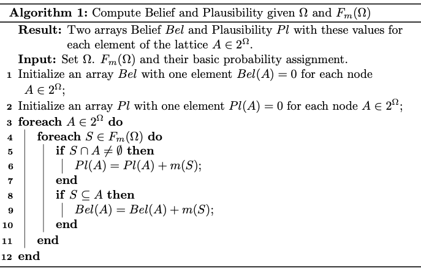
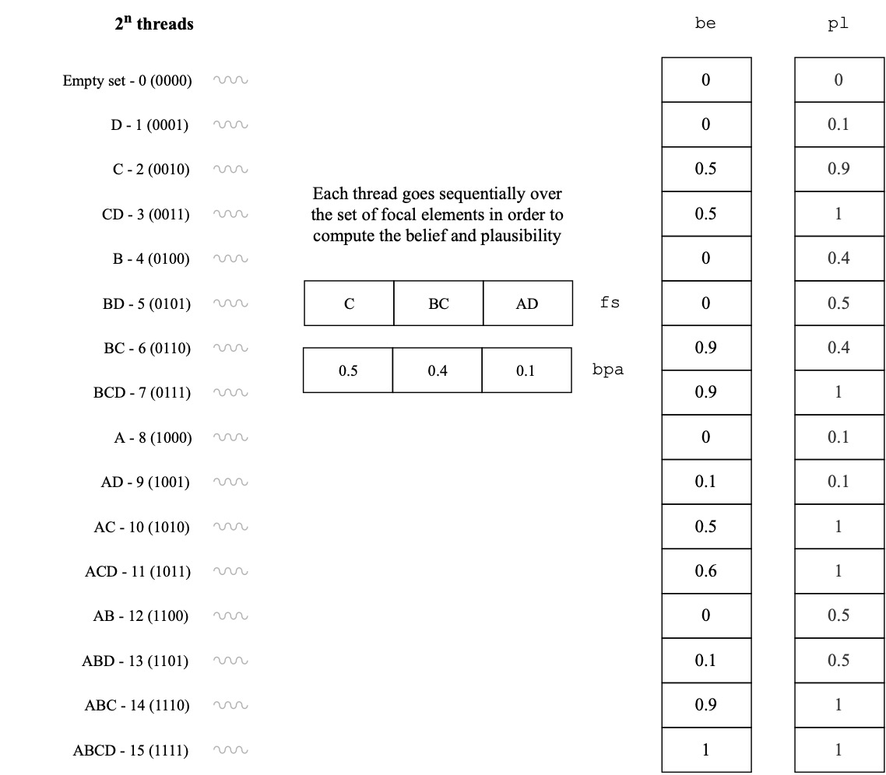
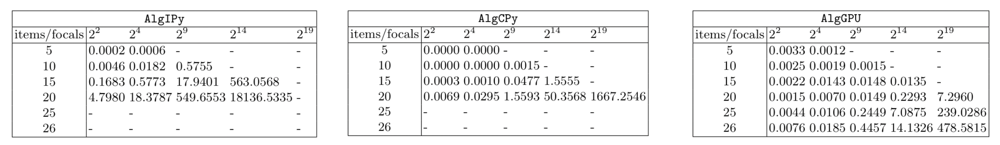
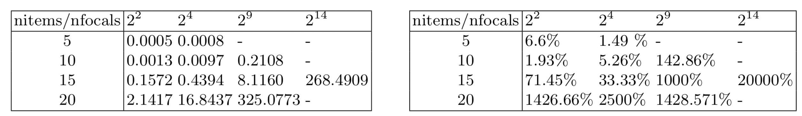
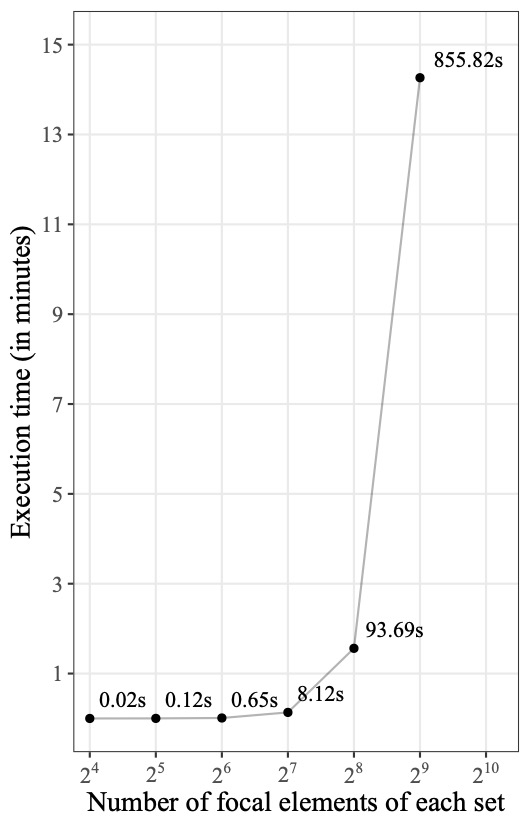

```{r xaringanExtra, echo = FALSE}
# meter en css para una apariencia mas latex
 #nature:
      #slideNumberFormat: "%current%/%total%"
xaringanExtra::use_logo("logo.png")
xaringanExtra::use_progress_bar(color = "#1A292C", location = "bottom")
```


```{r setup, include=FALSE}
options(htmltools.dir.version = FALSE)
```

```{r xaringan-themer, include=FALSE, warning=FALSE}
# library(xaringanthemer)
# style_duo_accent(
#   primary_color = "#EBE9FD",
#   secondary_color = "#FF961C",
#   inverse_header_color = "#FFFFFF"
# )
```

# Index

- Software for Dempster-Shafer theory of evidence
- Advantages of GPU computations
- Efficient execution

---

# Basic functions I

</br>

## Belief

$$Bel(A)=\sum_{S\subseteq A} m(S)$$

</br>

## Plausibility

$$Pl(A)=\sum_{S \cap A \neq \emptyset} m(S)$$

---

# Basic functions II

</br>

## Dempster's combination rule

$$m_{1,2}(A) = \frac{1}{1-Z} \sum\limits_{B \cap C = A} m_1(B) \cdot m_2(C)$$
where

$$Z = \sum\limits_{B \cap C = \emptyset} m_1(B) \cdot m_2(C)$$

is a measure of *conflict* between the two basic probability assignment sets. In addition, $m_{1,2}(\emptyset) = 0$ by definition.

---

# Available software

<br/>

| Link           | Language     | Author                       | Comments                                                                                |
|----------------|--------------|------------------------------|-----------------------------------------------------------------------------------------|
| TBM            | MATLAB       | Philippe Smets               | TBM, FMT                                                                                |
| Software       | R and MATLAB | Thierry Denœux               | Clustering, Distance-based Classification, Approximation                                |
| iBelief        | R            | Kuang Zhou and Arnaud Martin | Some basic functions to implement belief functions.                                     |
| Belief Package | R            | Sébastien Destercke          | Some basic functions to deal with discrete belief functions.                            |
| pyds           | Python       | Thomas Reineking             | A Python library for performing calculations in the Dempster-Shafer theory of evidence. |

<br/>

Software available in the according to [https://bfasociety.org](https://bfasociety.org)].

---

# New software based on GPU

- Compute the functions in parallel

## Why Python?

- Numba package for CUDA
- Google Colab [https://colab.research.google.com](https://colab.research.google.com)


---

# Algorithm



---

# Parallel approach

.center[
```{r, echo=FALSE, out.width="70%"}

```
]

---

# Execution time

Three different algorithms:

- Executed on the CPU
  - `AlgIPy`
  - `AlgCPy`
- Executed on the GPU
  - `AlgGPU`
  
  <br/><br/>
  
Execution times obtained with each of the algorithms:

```{r, echo=FALSE, out.width="100%"}

```

---

# Comparison of the execution time

<br/>

Comparison of the execution time with the existing Python package `pyds`

<br/>

```{r, echo=FALSE, out.width="100%"}

```

---

# Execution time combination rule


- Each thread evaluates, in parallel, one of the different pairs of focal elements $\{(B,C)\,|\,B \in F_{m_1}(\Omega) \land C \in F_{m_2}(\Omega)\}$, computing its intersection as well as the corresponding result obtained from $m_1(B) \cdot m_2(C)$.
- Then, one single thread goes sequentially over all the obtained intersections, grouping the ones that represent the same focal element in order to create the resulting focal set $F_3(\Omega)$ and the corresponding basic probabilities assignment of the focal elements.
- The threads are again used to divide in parallel the summed masses obtained for all $A \in F_3(\Omega)$ by $1-Z$.

.left[
```{r, echo=FALSE, out.width="20%"}

```
]


---

# Package 📦

```{python eval=FALSE, include=TRUE}
# Create a Frame of Discernment for the items a, b, c, d using a list
fod1 = ds.FrameOfDiscernment(['a', 'b', 'c', 'd'])
```

```{python eval=FALSE, include=TRUE}
# Create focal set for the frame of discernment
fs1 = ds.FocalSet(fod1, 
    {
        "abc": 0.4,
        "abdc": 0.3,
        "a": 0.3
    })
```

```{python eval=FALSE, include=TRUE}
# Create lattice
lat = ds.Lattice(fod1, fs1)
```

```{python eval=FALSE, include=TRUE}
# Compute the plausibility
lat.pl()
# Compute the belief
lat.bel()
```

---
class: inverse, center, middle

# 📨 noeliarico@uniovi.es

**Thank you very much for your attention!**

What would you like to see in our package?

```{r, echo=FALSE, out.width="30%"}

```

🌐 www.noeliarico.dev
